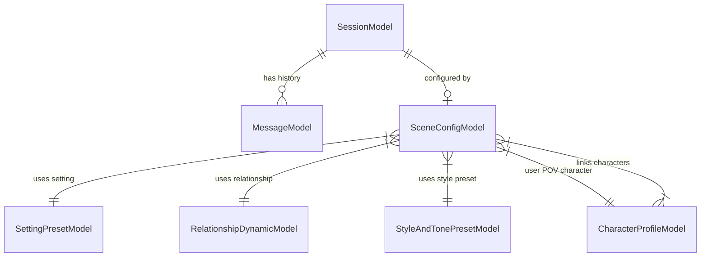

# Core AI Chat Engine (erofic.ai)

A headless, event-driven AI fiction and chat engine built with **FastAPI**, **SQLite** (SQLAlchemy 2.0 Async), and **OpenAI's SDK**. Designed to simulate book-like, dialogue-heavy fiction reading experiences with modular scene initialization, time-aware context management, and structured LLM responses.

---

## 📚 Project Documentation & References

- **[REQUIREMENTS.md](REQUIREMENTS.md)**: Full project specifications, functional requirements, scene component architectures, and system expectations.
- **[ROADMAP.md](ROADMAP.md)**: Phased task breakdown and completion status.

---

## ⚡ Core Features & Capabilities

- **Book-like Immersion**: Optimized for dialogue-heavy fiction (initial focus on erotic romance / erotica), generating novel-style prose with proper quotation marks and zero AI assistant bleed.
- **Modular Scene Initialization**: Assemble active story scenes by mixing and matching modular, reusable components:
  - **Character Profiles**: Detailed appearance, personality, voice, and desire profiles (`Koyomi`, `Shinobu`, `Hitagi`).
  - **Setting Presets**: Sensory-rich locations and ambient atmospheres (`Koyomi's Bedroom`, `Hitagi's Apartment Room`).
  - **Relationship Dynamics**: Nuanced relational history, power dynamics, and emotional tension (`Master & Servant`, `Dominant & Possessive Attachment`).
  - **3-Phase Style Presets**: Dynamic narrative progression system shifting through **Phase 1** (Witty Banter & Spark), **Phase 2** (Intimate Vulnerability), and **Phase 3** (Explicit & Steamy Passion).
- **Role Assignments**: Assign characters explicitly to relationship roles (e.g. `Master: Shinobu`, `Servant: Koyomi`).
- **Pre-Loaded Seed Library**: Ships with curated characters, settings, relationships, style presets, and 1-click pre-packaged scenarios. Custom creations are automatically persisted to the user library.
- **Event-Driven Architecture**: Operates on discrete triggers (user API messages or background timers), executes bounded logic, and spins down.
- **Autonomous In-Memory Re-Pings**: Automatically schedules background re-ping timers (default 30s) to keep story pacing dynamic.

---

## 🏛️ Data Architecture & Models



### Core Entities:
- **`CharacterProfileModel`** (`character_profiles`): `id`, `name`, `appearance`, `personality_and_voice`, `desires_and_dynamics`, `is_custom`.
- **`SettingPresetModel`** (`setting_presets`): `id`, `title`, `location_description`, `sensory_details`, `mood_tags`, `is_custom`.
- **`RelationshipDynamicModel`** (`relationship_dynamics`): `id`, `name`, `history_description`, `power_dynamic`, `current_tension`, `is_custom`.
- **`StyleAndTonePresetModel`** (`style_presets`): `id`, `name`, `pacing`, `sensory_focus`, `phase_1_prompt`, `phase_2_prompt`, `phase_3_prompt`, `is_custom`.
- **`SceneConfigModel`** (`scene_configs`): `id`, `session_id`, `title`, `setting_id`, `relationship_id`, `style_id`, `user_pov_character_id`, `role_assignments` (JSON), `current_phase`, `is_custom`.

---

## 🛠️ Tech Stack

- **Language**: Python 3.11+ (Python 3.14 compatible)
- **Framework**: FastAPI (REST API & background event orchestration)
- **Database**: SQLite (via SQLAlchemy 2.0 Async + `aiosqlite`)
- **LLM Integration**: OpenAI Python SDK (Structured JSON schemas)
- **Scheduler**: In-memory `asyncio` Timer Handles
- **Testing**: `pytest` & `pytest-asyncio`

---

## 🚀 Getting Started

### 1. Prerequisites
Ensure you have Python 3.11+ installed on your system.

### 2. Environment Setup

```bash
# Clone the repository
git clone <repository-url>
cd erofic.ai

# Create and activate virtual environment
python3 -m venv .venv
source .venv/bin/activate

# Install dependencies
pip install -r requirements.txt
```

### 3. Configuration (.env)

Copy `.env.example` to `.env` and set your OpenAI / Local LLM credentials:

```bash
cp .env.example .env
```

Configuration parameters:
- `DATABASE_URL`: `sqlite+aiosqlite:///./sql_app.db`
- `OPENAI_API_KEY`: API key (`ollama` or OpenAI key)
- `OPENAI_BASE_URL`: API Endpoint (`http://localhost:11434/v1`)
- `OPENAI_MODEL`: Model identifier (`gpt-4o` or local model)
- `LOG_LEVEL`: Logging verbosity (`INFO`)

---

## 🏃 Running the Application

Start the FastAPI server:

```bash
uvicorn app.main:app --reload --port 8000
```

On startup, the server automatically initializes database tables and seeds default characters (`Koyomi`, `Shinobu`, `Hitagi`), settings, relationships, 3-phase style presets, and pre-packaged scenarios.

- **Interactive OpenAPI / Swagger Documentation**: [http://127.0.0.1:8000/docs](http://127.0.0.1:8000/docs)
- **Health Check**: [http://127.0.0.1:8000/health](http://127.0.0.1:8000/health)

---

## 📡 REST API Reference

### 1. Scene Components & Library APIs

#### Characters (`/api/characters`)
- `GET /api/characters` - List all character profiles in library
- `POST /api/characters` - Create a new character profile
- `GET /api/characters/{id}` - Get character profile by ID
- `PUT /api/characters/{id}` - Update character profile
- `DELETE /api/characters/{id}` - Delete character profile

#### Settings (`/api/settings`)
- `GET /api/settings` - List all setting presets
- `POST /api/settings` - Create a new setting preset
- `GET /api/settings/{id}` - Get setting preset by ID
- `PUT /api/settings/{id}` - Update setting preset
- `DELETE /api/settings/{id}` - Delete setting preset

#### Relationships (`/api/relationships`)
- `GET /api/relationships` - List all relationship dynamics
- `POST /api/relationships` - Create a new relationship dynamic
- `GET /api/relationships/{id}` - Get relationship dynamic by ID
- `PUT /api/relationships/{id}` - Update relationship dynamic
- `DELETE /api/relationships/{id}` - Delete relationship dynamic

#### Style & Tone Presets (`/api/styles`)
- `GET /api/styles` - List all 3-phase style presets
- `POST /api/styles` - Create a new 3-phase style preset
- `GET /api/styles/{id}` - Get style preset by ID
- `PUT /api/styles/{id}` - Update style preset
- `DELETE /api/styles/{id}` - Delete style preset

#### Scene Configurations (`/api/scenes`)
- `GET /api/scenarios/presets` - List pre-packaged 1-click scenarios
- `GET /api/scenes` - List all scene configurations
- `POST /api/scenes` - Assemble a new scene configuration (link setting, relationship, style, characters, `role_assignments`, `current_phase`)
- `GET /api/scenes/{id}` - Get scene configuration with full eager-loaded details
- `PUT /api/scenes/{id}` - Update scene configuration
- `DELETE /api/scenes/{id}` - Delete scene configuration

---

### 2. Chat Session & Messaging APIs

#### Sessions (`/sessions`)
- `POST /sessions` - Create a new chat session
- `GET /sessions` - Fetch all chat sessions

#### Messaging (`/sessions/{id}/message`)
- `POST /sessions/{id}/message` - Post user message and dispatch background LLM event processor
- `GET /sessions/{id}/messages` - Fetch chat message history for session

---

## 🧪 Running Tests

Run the complete 23-test suite using `pytest`:

```bash
pytest -v
```

---

## 📁 Directory Structure

```text
erofic.ai/
├── app/
│   ├── api/          # FastAPI routers & schemas (routes.py, schemas.py)
│   ├── core/         # App settings & environment configs (config.py)
│   ├── db/           # Async database sessions, seed data, & CRUD repositories (crud.py, seed.py)
│   ├── engine/       # LLM client, prompt builder, context manager, & safety guardrails
│   ├── models/       # SQLAlchemy models (session.py, message.py, scene.py)
│   └── scheduler/    # In-memory timer manager (manager.py)
├── tests/            # Test suite (test_scene_components.py, test_seed.py, test_api.py, etc.)
├── .env.example      # Example environment configuration
├── pytest.ini        # Pytest configuration
├── README.md         # Project documentation & API reference
├── REQUIREMENTS.md   # Functional requirements document
└── requirements.txt  # Python dependencies
```
